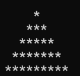
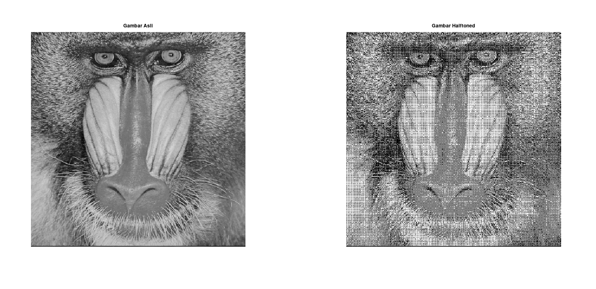
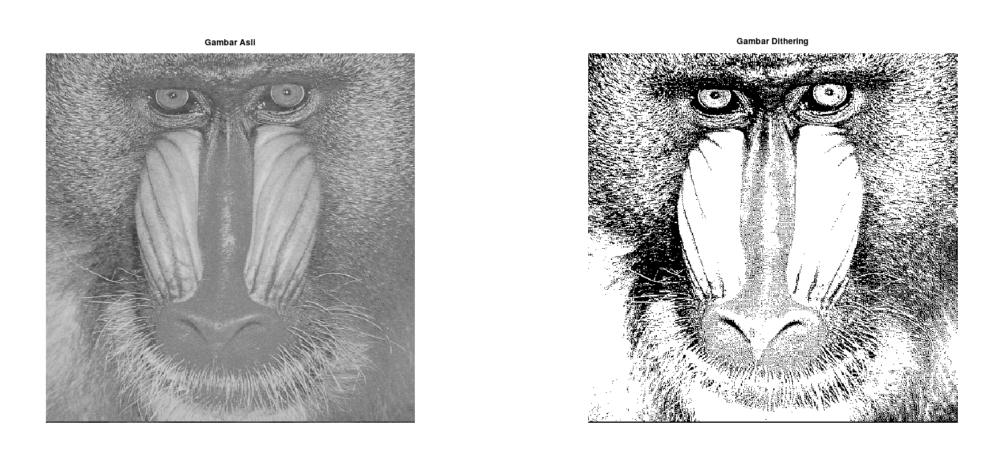

   <h2> Tugas Pemrosesan Citra Digital</h2>

  

   <h5> Nama: </h5> 
 Maulidya       (2310131120003)

   <h5> Dosen Pengampu: </h5> 
Dr. Harja Santana Purba,M.Kom.
 
Novan A.B.Saputra, S.Kom.,M.T

    <h1>Daftar Isi</h1>
    <h3>
        <ul style="list-style-type: none; padding: 0; color: black;">
            <li><a style="color:black;">Pendahuluan</a></li>
            <li><a href="#Apengertian-halftoning" style="color:black;">Halftoning: Patterning & Dithering</a></li>
            <li><a href="#11-halftoning-patterning" style="color:black;">Halftoning: Patterning</a></li>
            <li><a href="#12-halftoning-dithering" style="color:black;">Halftoning: Dithering</a></li>
        </ul>
    </h3>

## Pendahuluan

Halftoning adalah teknik yang digunakan dalam reproduksi gambar untuk mensimulasikan gradasi warna atau intensitas cahaya pada perangkat yang memiliki kemampuan terbatas untuk menampilkan tingkat warna atau intensitas yang kontinyu. Teknik ini digunakan pada banyak media seperti pencetakan, layar komputer, atau televisi, di mana hanya sejumlah terbatas warna atau level intensitas yang bisa ditampilkan.

Ada dua metode utama dalam halftoning, yaitu patterning dan dithering. Keduanya memiliki tujuan yang sama—menyajikan ilusi gambar yang lebih detail atau bergradasi halus, namun dengan pendekatan yang berbeda.

### 1. **Patterning**
Patterning adalah metode halftoning yang mengubah gradasi warna atau tingkat abu-abu menjadi pola terstruktur atau geometris. Pada metode ini, setiap bagian dari gambar akan diwakili oleh pola titik yang bervariasi dalam ukuran atau jaraknya tergantung pada intensitas warna yang ingin ditampilkan. Misalnya, daerah terang akan diwakili oleh titik yang lebih kecil atau lebih jarang, sementara daerah gelap akan diwakili oleh titik yang lebih besar atau lebih padat.

Metode patterning sering digunakan dalam pencetakan karena sifatnya yang teratur dan mudah dikontrol. Penggunaan patterning sangat terlihat pada proses cetak surat kabar atau majalah, di mana gambar yang penuh warna disimulasikan menggunakan titik-titik hitam dengan pola tertentu.

### 2. **Dithering**
Dithering adalah teknik yang lebih kompleks dan acak dibandingkan dengan patterning. Pada dithering, nilai intensitas warna dari setiap piksel tidak hanya dikonversi ke warna terdekat, tetapi juga disertai dengan penyebaran kesalahan kuantisasi (quantization error) ke piksel-piksel tetangga. Teknik ini membuat gradasi warna tampak lebih halus dengan menciptakan pola noise yang tidak teratur, menghasilkan ilusi transisi yang lebih alami pada area dengan perubahan warna yang bertahap.

Salah satu algoritma dithering yang terkenal adalah **Floyd-Steinberg Dithering**, yang menyebarkan error ke piksel di sebelahnya untuk mencapai gradasi yang lebih halus. Dithering sering digunakan dalam grafik komputer, terutama pada gambar dengan palet warna terbatas, seperti dalam pengaturan 8-bit atau 16-bit.

### Relevansi Halftoning di Dunia Modern
Baik patterning maupun dithering sangat penting dalam pengolahan gambar digital maupun cetak. Dalam pencetakan, halftoning memungkinkan gambar berkualitas tinggi ditampilkan pada media cetak dengan warna atau resolusi terbatas. Dalam dunia digital, halftoning, terutama dithering, banyak digunakan pada gambar yang ditampilkan dengan palet warna terbatas, menjaga detail visual dengan menghindari artefak visual yang kasar.

Dengan berkembangnya teknologi, teknik-teknik ini terus memainkan peran penting dalam berbagai aplikasi, mulai dari pencetakan gambar, desain grafis, hingga pengoptimalan tampilan pada perangkat elektronik.

# Halftoning : Patterning & Dithering
    
Halftoning adalah teknik yang digunakan untuk menciptakan ilusi gradasi warna atau kecerahan pada gambar, terutama dalam media cetak yang terbatas hanya pada penggunaan tinta hitam atau warna solid. Dua metode yang sering digunakan dalam halftoning adalah patterning dan dithering. Berikut adalah penjelasan masing-masing:

**Terdapat dua metode halftoning dalam mengolah gambar:**

* Patterning (pola)
* Dithering (pengacakan)

## Halftoning: Patterning
 
 Patterning adalah metode halftoning di mana gambar diwakili oleh pola titik yang teratur. Setiap blok piksel diwakili oleh pola titik yang bervariasi dalam kepadatannya untuk mensimulasikan tingkat kecerahan.

 * Cara Kerja:
    * Gambar dibagi menjadi grid atau sel, dan setiap sel diberikan pola titik tetap. Pola ini biasanya terdiri dari titik-titik hitam yang disusun dalam bentuk tertentu. Semakin gelap area gambar, semakin banyak titik dalam pola tersebut.
    * Setiap blok piksel pada gambar asli diubah menjadi pola titik hitam dan putih yang ukurannya tetap, tetapi kepadatannya berubah berdasarkan intensitas kecerahan piksel asli.

* Ciri Utama:
  * Titik-titik disusun dalam pola yang teratur (biasanya dalam bentuk persegi atau lingkaran).
  * Pola titik selalu memiliki ukuran yang sama, hanya jumlah atau distribusi titik yang berubah untuk merepresentasikan kecerahan.

* Kelebihan:
  * Mudah diimplementasikan.
  * Hasil cetakan cenderung bersih dan konsisten.

* Kekurangan:
  Kadang-kadang menghasilkan pola yang terlalu terlihat jelas (seperti "moiré") dan tidak halus ketika dilihat dari dekat.

* Contoh Penggunaan:

    Patterning sering digunakan dalam teknik cetak yang lebih sederhana dan terbatas dalam resolusi. Ini dapat dilihat dalam beberapa teknik pencetakan layar (screen printing) atau media cetak tradisional.

**Langkah - langkah patterning dalm mengolah gambar:**
1. Konversi Gambar ke Grayscale
   * Jika gambar asli berwarna, ubah gambar tersebut menjadi grayscale (hitam-putih) terlebih dahulu. Hal ini dilakukan agar gambar lebih mudah diolah menggunakan titik-titik untuk mensimulasikan tingkat kecerahan.

        Langkah:
    
        Gunakan aplikasi pengolahan gambar seperti Photoshop,octave,jupyter atau GIMP untuk mengonversi gambar dari mode warna ke grayscale.
    
        Contoh: 
    
        Foto berwarna wajah diubah menjadi gambar dengan skala abu-abu.
2. Pembagian Gambar Menjadi Blok atau Sel
    * Gambar dibagi menjadi blok-blok kecil yang akan diwakili oleh pola titik yang tetap dalam setiap blok tersebut. Ukuran blok menentukan resolusi hasil akhir dari halftoning.
        
        Langkah:

        Tentukan ukuran sel atau blok, misalnya 4x4 piksel. Setiap blok akan diisi oleh pola titik yang berbeda-beda sesuai tingkat kecerahannya.

3. Pengukuran Kecerahan di Setiap Blok
    * Untuk setiap blok piksel, hitung rata-rata kecerahan atau intensitas dari piksel-piksel di dalam blok tersebut. Semakin terang area tersebut, semakin sedikit titik yang akan digunakan dalam pola.
       Langkah:

        Hitung rata-rata intensitas piksel di dalam setiap blok (misalnya, 0 untuk hitam dan 255 untuk putih).
      
       Contoh: Jika ada 4x4 piksel dengan intensitas bervariasi, rata-rata intensitas dihitung untuk menentukan kepadatan titik di blok tersebut.

4. Pemilihan Pola Titik
    
    * Berdasarkan rata-rata kecerahan blok, pilih pola titik yang sesuai dari pola yang sudah ditentukan sebelumnya. Setiap pola merepresentasikan intensitas tertentu, dari titik penuh untuk area gelap hingga tidak ada titik sama sekali untuk area terang.
        
        Langkah:

        * Siapkan pola titik dengan berbagai tingkat kepadatan, misalnya pola dengan 1 titik (untuk area terang) hingga pola penuh dengan titik (untuk area gelap).
        
        Contoh Pola:
        * Tingkat Terang (Intensitas Tinggi): Pola hanya memiliki 1-2 titik kecil.
        * Tingkat Sedang (Intensitas Menengah): Pola memiliki lebih banyak titik.
        * Tingkat Gelap (Intensitas Rendah): Pola memiliki titik yang lebih padat.

5. Pengisian Blok dengan Pola Titik
    * Setiap blok diisi dengan pola titik yang sesuai dengan kecerahan rata-rata yang telah dihitung. Titik-titik ini ditempatkan dengan ukuran dan posisi tetap di seluruh blok.
        
        Langkah:
         * Terapkan pola titik untuk setiap blok gambar. Pola titik tetap sama ukurannya, tetapi jumlah titik bervariasi tergantung pada tingkat kecerahan blok.

        Contoh: Area wajah yang terang mungkin hanya menggunakan pola dengan sedikit titik, sementara bayangan di sekitar hidung atau pipi akan diisi dengan pola titik yang lebih padat.

6. Penggabungan Pola untuk Seluruh Gambar
    * Setelah setiap blok terisi dengan pola titik yang sesuai, gambar akan tampak seperti gabungan dari pola-pola titik yang berbeda tingkat kerapatannya.
       
        Langkah:

        Setelah pola diterapkan pada seluruh gambar, gabungkan hasil blok-blok tersebut untuk menciptakan gambar halftone yang utuh.

**Contoh Penerapan Langkah-langkah**

**Perhitungan sederhana**
  * Konversi ke Grayscale
    
    Jika gambar awalnya berwarna, ubah gambar tersebut menjadi grayscale. Namun, dalam contoh ini, gambar sudah dalam format grayscale.

  * Gambar Sederhana (5x5 Piksel)
    
    * 200 200 200 100 100
    * 200 200 200 100 100
    * 150 150 150 80 80
    * 150 150 150 80 80
    * 100 100 100 50 50

  * Pembagian Gambar Menjadi Blok
    Bagilah gambar menjadi blok-blok kecil. Untuk kemudahan, kita akan menggunakan blok 2x2 piksel:

    Blok 1:
     * 200 200
     * 200 200
    
    Blok 2:
     * 100 100
     * 100 100

    Blok 3:
     * 150 150
     * 150 150

    Blok 4:
     * 80 80
     * 80 80

    Blok 5:
    * 100 100
    * 50  50

* Hitung Rata-rata Kecerahan
  
  Hitung rata-rata intensitas kecerahan untuk setiap blok:

    Blok 1:
    
    Rata-rata = (200 + 200 + 200 + 200) / 4 = 200
   
    Blok 2:
    
    Rata-rata = (100 + 100 + 100 + 100) / 4 = 100

    Blok 3:
    
    Rata-rata = (150 + 150 + 150 + 150) / 4 = 150

    Blok 4:
    
    Rata-rata = (80 + 80 + 80 + 80) / 4 = 80

    Blok 5:
    
    Rata-rata = (100 + 100 + 50 + 50) / 4 = 75

* Pilih Pola Titik Berdasarkan Rata-rata Intensitas
  
  Tentukan pola titik untuk setiap blok berdasarkan kecerahan rata-rata. Misalnya, kita bisa menggunakan pola berikut:

   * Intensitas 200 (Putih):
        * Pola Titik Putih (Kosong):

                  □ □
                  □ □
   * Intensitas 100 (Abu-Abu Gelap):
        * Pola Titik Sedang:

                  ■ □
                  □ ■
   * Intensitas 150 (Abu-Abu Sedang):
        * Pola Titik Menengah:

                 ■ □
                 ■ □
   *Intensitas 80 (Abu-Abu Gelap):
        * Pola Titik Hampir Penuh:

                ■ ■
                ■ ■
    
* Gabungan akhir

      □ □ □ ■ □
      □ □ □ ■ □
      ■ □ ■ □ □
      ■ □ ■ □ □
      ■ ■ ■ □ □
     
**Contoh Pseoducode 1**

      Input: Grayscale image G dengan ukuran NxM piksel
      Output: Gambar halftoning H dengan pola titik

      1. Tentukan ukuran blok BxB (misal: 2x2 atau 3x3)
      2. Buat tabel pola titik (dot patterns) berdasarkan tingkat intensitas

        Misal:
          - Pola kosong untuk intensitas tinggi (hampir putih)
          - Pola sebagian untuk intensitas sedang
          - Pola penuh untuk intensitas rendah (hampir hitam)

      3. Untuk setiap blok dalam gambar G:
        a. Ambil piksel-piksel dalam blok berukuran BxB
        b. Hitung rata-rata intensitas blok tersebut
        c. Pilih pola titik berdasarkan rata-rata intensitas
        d. Gantikan blok tersebut dengan pola titik yang sesuai di gambar H

      4. Kembalikan gambar H

      End

**Contoh Pseducode 2**
   
    Input: G (grayscale image 6x6)
    Output: H (halftoned image)

    Step 1: Tentukan ukuran blok B = 2x2

    Step 2: Tentukan tabel pola titik:
      - Intensitas tinggi (200-255) → Pola: □ □ □ □
      - Intensitas sedang (100-199) → Pola: ■ □ □ □
      - Intensitas rendah (0-99) → Pola: ■ ■ □ □

    Step 3: Proses setiap blok:

    For i from 1 to 6 step 2:  # Untuk setiap baris dengan loncatan 2 piksel
      For j from 1 to 6 step 2:  # Untuk setiap kolom dengan loncatan 2 piksel
        Block = G[i:i+1, j:j+1]  # Ambil blok 2x2 dari gambar G
        Avg_intensity = Rata-rata nilai piksel dalam blok
        Pola = Pilih pola titik berdasarkan Avg_intensity
        Gantikan blok G[i:i+1, j:j+1] dengan Pola di gambar H

    Step 4: Output H

**Kode Program Octave menentukan Pola Piramida**
      
      n = 5; 

      for i = 1:n
          for j = 1:(n-i)
              fprintf(' ');  % Cetak spasi
          end
          for k = 1:(2*i-1)
              fprintf('*');
          end
          fprintf('\n');
      end

**Output**

**Kode Program Halftoning:patterning**

        pkg load image; % Memastikan paket image terinstal

        function halftone_patterning(input_image, output_image)
            % Membaca gambar
            img = imread("orang.tif");

            % Mengubah gambar menjadi grayscale
            if size(img, 3) == 3
                img = rgb2gray(img);
            end

            % Mendapatkan ukuran gambar
            [rows, cols] = size(img);

            % Membuat gambar kosong untuk output
            halftoned_img = zeros(rows, cols);

            % Thresholding (menggunakan pola 4x4 untuk halftoning)
            dither_matrix = [
                0  8  2 10;
                12  4 14  6;
                3 11  1  9;
                15  7 13  5
            ];

            % Mengubah ukuran dither matrix sesuai dengan ukuran gambar
            [dither_rows, dither_cols] = size(dither_matrix);

            % Looping untuk setiap piksel
            for i = 1:rows
                for j = 1:cols
                    % Mengambil nilai intensitas piksel
                    pixel_value = img(i, j);

                    % Menentukan threshold berdasarkan dither_matrix
                    threshold = (dither_matrix(mod(i-1, dither_rows)+1, mod(j-1, dither_cols)+1) / 16) * 255;

                    % Mengubah piksel berdasarkan threshold
                    if pixel_value > threshold
                        halftoned_img(i, j) = 255; % Putih
                    else
                        halftoned_img(i, j) = 0;   % Hitam
                    end
                end
            end

            % Menyimpan gambar halftoned
            imwrite(uint8(halftoned_img), output_image);

            % Menampilkan gambar asli dan hasil halftoning
            figure;
            subplot(1, 2, 1), imshow(img), title('Gambar Asli');
            subplot(1, 2, 2), imshow(halftoned_img), title('Gambar Halftoned');
        end

        % Memanggil fungsi dengan nama file input dan output
        halftone_patterning('input_image.jpg', 'output_halftoned.jpg');

**Output**

## Halftoning: Dithering

Dithering adalah metode halftoning yang lebih kompleks, di mana titik-titik ditempatkan secara acak atau semi-acak untuk mensimulasikan gradasi kecerahan. Dengan menggunakan pola yang tidak teratur, dithering memberikan hasil yang lebih halus dan lebih alami.

Cara Kerja:

* Dithering mengganti piksel dalam gambar asli dengan titik-titik hitam dan putih yang ditempatkan secara acak atau semi-acak berdasarkan algoritma tertentu. Titik-titik ini dibuat sedemikian rupa sehingga mata manusia akan menggabungkannya menjadi gradasi kecerahan ketika dilihat dari jarak jauh.
* Algoritma seperti Floyd-Steinberg Dithering digunakan untuk menyebarkan kesalahan antara nilai piksel asli dan nilai yang dihasilkan, sehingga distribusi titik-titik lebih merata dan hasil gradasinya lebih halus.

Ciri Utama:

* Titik-titik ditempatkan secara acak atau dengan pola tak teratur.
* Ukuran titik bisa seragam, tetapi distribusi titik berubah sesuai dengan tingkat kecerahan.
  
Kelebihan:
* Hasil lebih halus dan tidak terlihat seperti pola.
* Lebih baik dalam menciptakan gradasi yang halus dibandingkan patterning.

Kekurangan:
* Lebih kompleks dan membutuhkan lebih banyak daya komputasi.
* Dalam beberapa kasus, dithering dapat menghasilkan efek noise atau grain pada gambar jika resolusinya rendah.

* Contoh Penggunaan:

  Dithering sering digunakan dalam cetakan digital, layar komputer, dan teknik pencetakan yang membutuhkan hasil halftoning yang halus. Ini juga umum digunakan dalam pengolahan gambar digital untuk menurunkan kedalaman warna tanpa mengorbankan detail gambar.
  Perbedaan Utama antara Patterning dan Dithering
* Pola Titik:

    * Patterning: Menggunakan pola titik tetap dan teratur dalam setiap sel gambar.
    * Dithering: Menggunakan pola titik yang tidak teratur atau acak, menciptakan distribusi titik yang lebih halus.

* Kualitas Hasil:

    * Patterning: Kadang menghasilkan pola visual yang lebih mudah terlihat (seperti pola grid), terutama pada gambar yang memiliki gradasi halus.
    * Dithering: Memberikan hasil yang lebih halus, tanpa pola yang terlalu terlihat, membuatnya lebih cocok untuk gambar dengan gradasi halus.

* Kompleksitas:

    * Patterning: Lebih sederhana dan cepat diterapkan.
    * Dithering: Lebih kompleks dan membutuhkan komputasi lebih, terutama dalam algoritma penyebaran kesalahan (error diffusion).

* Kehalusan Gradasi:

    * Patterning: Cenderung kurang halus dalam gradasi karena pola titik teratur.
    * Dithering: Lebih baik dalam menciptakan ilusi gradasi halus karena pola titik acak.

**Langkah-langkah dithering dalam menentukan gambar**
 1. Persiapan Gambar
    * Input Gambar: Siapkan gambar yang ingin Anda proses, baik itu berwarna atau grayscale.
    * Konversi ke Grayscale (Jika Diperlukan): Jika Anda ingin menerapkan dithering ke gambar hitam putih, konversikan gambar berwarna menjadi grayscale. Setiap piksel akan memiliki nilai intensitas di antara 0 (hitam) hingga 255 (putih).
    
    Contoh dalam kode Octave untuk konversi ke grayscale:

          img = imread('gambar.jpg');  % Baca gambar
          grayscale_img = rgb2gray(img);  % Konversi ke grayscale

2. Tentukan Palet Warna yang Terbatas
    * Palet Warna: Tentukan palet warna yang terbatas, misalnya dua warna (hitam dan putih) untuk gambar hitam putih atau jumlah warna tertentu untuk gambar berwarna.
    * Kuantisasi: Setiap piksel pada gambar diubah menjadi warna terdekat dalam palet yang ditentukan.

  Dalam contoh hitam-putih (biner), nilai piksel 0 dianggap hitam dan 255 dianggap putih. Untuk gambar dengan 16 warna, Anda dapat mendefinisikan palet warna sebanyak 16 warna yang berbeda.

3. Lakukan Kuantisasi Awal
    * Pada setiap piksel, tentukan nilai warna terdekat dari palet terbatas. Misalnya, untuk gambar hitam putih, tentukan apakah nilai intensitas piksel lebih dekat ke hitam atau putih.
  Jika nilai intensitas piksel lebih kecil dari 128, maka piksel akan diubah menjadi hitam (0), dan jika lebih besar atau sama dengan 128, maka akan diubah menjadi putih (255).

  Contoh dalam Octave:

    binary_img = grayscale_img >= 128;  % Gambar hitam putih
    
4. Hitung Error Kuantisasi
  * Setelah piksel dikonversi ke warna terdekat, hitung error kuantisasi, yaitu selisih antara warna asli piksel dan warna terdekat yang dipilih.
  
  Error = Warna Asli - Warna Terdekat

  Contoh dalam Octave:

    error = double(grayscale_img) - double(binary_img) * 255;   

5. Distribusi Error (Error Diffusion)
      * Gunakan teknik Error Diffusion untuk menyebarkan error yang dihitung dari piksel saat ini ke piksel-piksel tetangganya. Penyebaran error dilakukan untuk mempertahankan detail gambar dengan membagi error ke beberapa piksel di sekitar piksel yang sedang diproses.
    Algoritma yang sering digunakan untuk ini adalah Floyd-Steinberg Dithering yang menyebarkan error ke piksel-piksel berikutnya di sekitarnya dengan proporsi tertentu:

            X  7/16
        3/16  5/16  1/16

    Artinya, error dari satu piksel disebarkan ke piksel-piksel di sebelah kanan, bawah kanan, bawah, dan bawah kiri.

**Pseudocode sederhana:**
    for each pixel (x, y):
        old_value = pixel(x, y)
        new_value = nearest_palette_color(old_value)
        pixel(x, y) = new_value
        error = old_value - new_value
        
        pixel(x+1, y)     += error * 7/16
        pixel(x-1, y+1)   += error * 3/16
        pixel(x, y+1)     += error * 5/16
        pixel(x+1, y+1)   += error * 1/16

    Contoh dalam Octave untuk Floyd-Steinberg Dithering:
      [rows, cols] = size(grayscale_img);
      for y = 1:rows-1
          for x = 2:cols-1
              old_pixel = grayscale_img(y, x);
              new_pixel = round(old_pixel / 255) * 255;  % Hitam atau Putih
              grayscale_img(y, x) = new_pixel;
              quant_error = old_pixel - new_pixel;
              % Sebarkan error
              grayscale_img(y, x+1) = grayscale_img(y, x+1) + quant_error * 7/16;
              grayscale_img(y+1, x-1) = grayscale_img(y+1, x-1) + quant_error * 3/16;
              grayscale_img(y+1, x) = grayscale_img(y+1, x) + quant_error * 5/16;
              grayscale_img(y+1, x+1) = grayscale_img(y+1, x+1) + quant_error * 1/16;
          end
      end

6. Iterasi untuk Setiap Piksel
    * Ulangi langkah distribusi error untuk setiap piksel dalam gambar, memprosesnya secara berurutan dari kiri ke kanan dan dari atas ke bawah. Pada setiap langkah, error dari piksel yang sedang diproses disebarkan ke piksel di sekitarnya.

7. Hasil Akhir
    Setelah seluruh gambar selesai diproses, hasil akhirnya adalah gambar yang menggunakan palet warna terbatas dengan gradasi halus yang dihasilkan oleh teknik dithering.

    Contoh hasil dithering untuk gambar hitam putih akan menghasilkan pola piksel yang tampak seperti bintik-bintik halus, tetapi jika dilihat dari kejauhan, gambar akan tampak memiliki gradasi yang lebih halus.

**Perhitungan Sederhana**

    Misalkan kita memiliki sebuah gambar kecil berukuran 3x3 piksel dengan nilai intensitas sebagai berikut (grayscale):

    
        120   200   180
        50    80    210
        90    170   220
* Langkah 1: Tentukan Ambang (Threshold)
      Dalam kasus ini, kita menggunakan skala biner (hitam dan putih). Misalnya, ambang batas (threshold) untuk menentukan apakah sebuah piksel hitam atau putih adalah 128.

        * Piksel dengan nilai >= 128 akan diubah menjadi putih (255).
        * Piksel dengan nilai < 128 akan diubah menjadi hitam (0).

* Langkah 2: Hitung Error Kuantisasi dan Sebarkan Error
      Kita akan menggunakan algoritma Floyd-Steinberg Dithering untuk menyebarkan error ke piksel di sebelah kanan, bawah kanan, bawah, dan bawah kiri.

      Distribusi error Floyd-Steinberg:

            *   7/16
        3/16   5/16   1/16

* Langkah 3: Proses Setiap Piksel
    Mulai dari piksel pertama di kiri atas (120), kita akan lakukan langkah berikut:

  * Piksel (1, 1): 120
      * Nilai asli: 120
      * Bandingkan dengan threshold (128):
          * 120 < 128, maka ubah piksel menjadi hitam (0).
      * Hitung error:
          * Error = 120 - 0 = 120
  * Sebarkan error ke tetangga:
      (1, 2) = 200 + (120 * 7/16) ≈ 200 + 52.5 ≈ 252.5
      (2, 1) = 50 + (120 * 3/16) ≈ 50 + 22.5 ≈ 72.5
      (2, 2) = 80 + (120 * 5/16) ≈ 80 + 37.5 ≈ 117.5
      (2, 3) = 210 + (120 * 1/16) ≈ 210 + 7.5 ≈ 217.5

    Hasil sementara:

        0   252.5   180
        72.5   117.5   217.5
        90    170   220

  * Piksel (1, 2): 252.5
      * Nilai asli: 252.5
      * Bandingkan dengan threshold (128):
            * 252.5 >= 128, maka ubah piksel menjadi putih (255).
      * Hitung error:
            *Error = 252.5 - 255 = -2.5
    * Sebarkan error ke tetangga:
      (1, 3) = 180 + (-2.5 * 7/16) ≈ 180 - 1.1 ≈ 178.9
      (2, 2) = 117.5 + (-2.5 * 3/16) ≈ 117.5 - 0.5 ≈ 117
      (2, 3) = 217.5 + (-2.5 * 5/16) ≈ 217.5 - 0.8 ≈ 216.7
      (3, 2) = 170 + (-2.5 * 1/16) ≈ 170 - 0.2 ≈ 169.8

      Hasil sementara:

          0   255   178.9
          72.5   117   216.7
          90   169.8   220

  * Piksel (1, 3): 178.9
     * Nilai asli: 178.9
     * Bandingkan dengan threshold (128):
          * 178.9 >= 128, maka ubah piksel menjadi putih (255).
      * Hitung error:
          * Error = 178.9 - 255 = -76.1
    * Sebarkan error ke tetangga:
      (2, 3) = 216.7 + (-76.1 * 7/16) ≈ 216.7 - 33.3 ≈ 183.4
      (3, 2) = 169.8 + (-76.1 * 5/16) ≈ 169.8 - 23.8 ≈ 146
      (3, 3) = 220 + (-76.1 * 1/16) ≈ 220 - 4.8 ≈ 215.2

      Hasil sementara:

          0   255   255
          72.5   117   183.4
          90   146   215.2

  * Piksel (2, 1): 72.5
      * Nilai asli: 72.5
      * Bandingkan dengan threshold (128):
          * 72.5 < 128, maka ubah piksel menjadi hitam (0).
      * Hitung error:
          * Error = 72.5 - 0 = 72.5
    * Sebarkan error ke tetangga:
      (2, 2) = 117 + (72.5 * 7/16) ≈ 117 + 31.7 ≈ 148.7
      (3, 1) = 90 + (72.5 * 3/16) ≈ 90 + 13.6 ≈ 103.6
      (3, 2) = 146 + (72.5 * 5/16) ≈ 146 + 22.7 ≈ 168.7
      (3, 3) = 215.2 + (72.5 * 1/16) ≈ 215.2 + 4.5 ≈ 219.7
      Hasil sementara:

          0   255   255
          0   148.7   183.4
          103.6   168.7   219.7

    Lanjutkan Langkah Ini Sampai Piksel Terakhir

Langkah 4: Hasil Akhir (Setelah Semua Piksel Diproses):
    Hasil dithering akhir (nilai biner):

        0   255   255
        0   255   255
        0   255   255

      Setiap piksel telah dikonversi menjadi hitam atau putih dengan distribusi error yang disebarkan ke tetangganya, menghasilkan ilusi gradasi di gambar dengan palet warna yang terbatas.

**Kode Program Dithering Menggunakan Octave**

    pkg load image; % Memastikan paket image terinstal

    function halftone_dithering(input_image, output_image)
        % Membaca gambar
        img = imread("orang.tif");

        % Mengubah gambar menjadi grayscale
        if size(img, 3) == 3
            img = rgb2gray(img);
        end

        % Mendapatkan ukuran gambar
        [rows, cols] = size(img);

        % Membuat gambar kosong untuk output
        halftoned_img = zeros(rows, cols);

        % Menggunakan threshold (0-255)
        for i = 1:rows
            for j = 1:cols
                % Mengambil nilai intensitas piksel
                pixel_value = img(i, j);

                % Menentukan nilai biner (hitam atau putih)
                if pixel_value > 127
                    halftoned_img(i, j) = 255; % Putih
                    error = pixel_value - 255;  % Hitung error
                else
                    halftoned_img(i, j) = 0;   % Hitam
                    error = pixel_value;        % Hitung error
                end

                % Sebarkan error ke tetangga (Floyd-Steinberg)
                if j < cols
                    img(i, j + 1) = img(i, j + 1) + error * 7 / 16; % Piksel kanan
                end
                if i < rows && j > 1
                    img(i + 1, j - 1) = img(i + 1, j - 1) + error * 3 / 16; % Piksel bawah kiri
                end
                if i < rows
                    img(i + 1, j) = img(i + 1, j) + error * 5 / 16; % Piksel bawah
                end
                if i < rows && j < cols
                    img(i + 1, j + 1) = img(i + 1, j + 1) + error * 1 / 16; % Piksel bawah kanan
                end
            end
        end

        % Menyimpan gambar halftoned
        imwrite(uint8(halftoned_img), output_image);

        % Menampilkan gambar asli dan hasil dithering
        figure;
        subplot(1, 2, 1), imshow(img), title('Gambar Asli');
        subplot(1, 2, 2), imshow(halftoned_img), title('Gambar Dithering');
    end

    % Memanggil fungsi dengan nama file input dan output
    halftone_dithering('input_image.jpg', 'output_dithering.jpg');

**Output**

# Daftar Pustaka

1. **Lau, Daniel Leo**. _Modern digital halftoning_. Arbor: UMI Company, 1999.

2. **Eran Steinberg, Robert J. Rolleston, Roger L. Easton Jr.**, "Analysis of random dithering patterns using second-order statistics," _Journal of Electronic Imaging_, vol. 1,Issue 4,1992. DOI:https://doi.org/10.1117/12.60717

